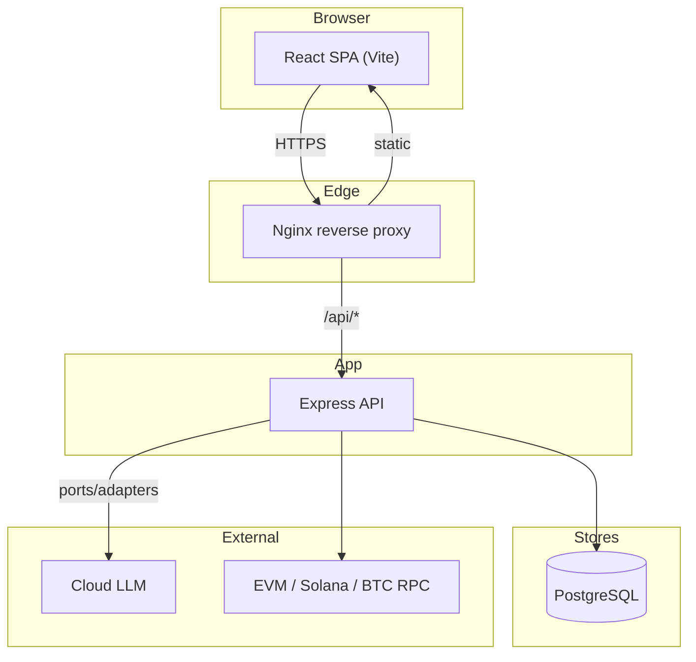
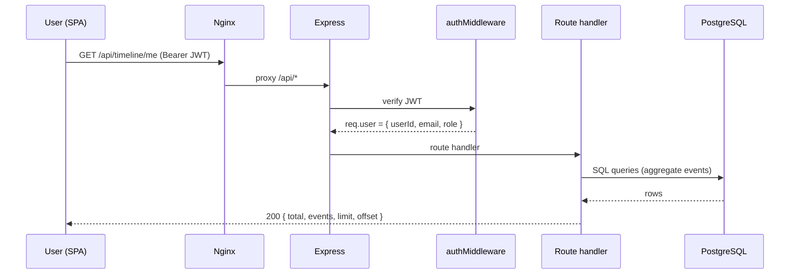
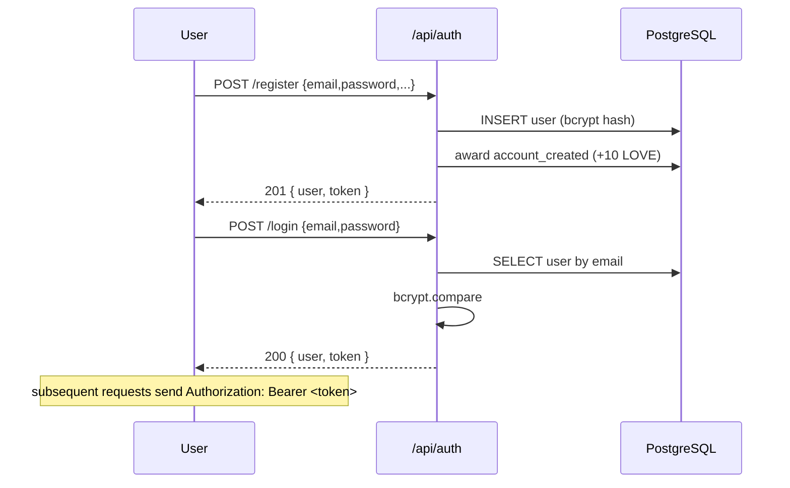
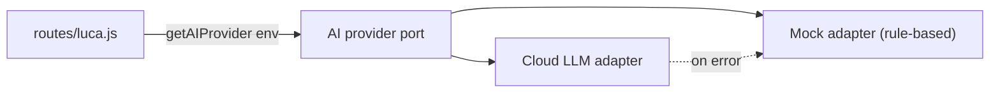
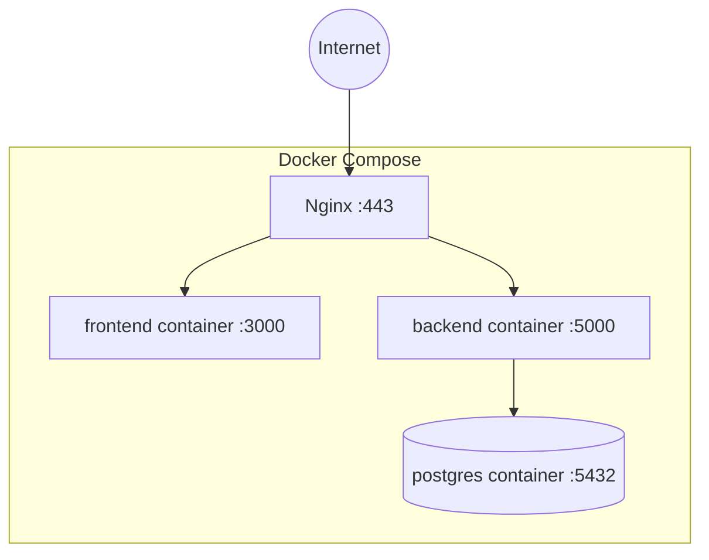

# Architecture

This document describes the architecture of **Solaris Health / LUCA Passport** —
its components, data flow, authentication, the hexagonal AI provider, the web3
integration, the sovereign vault export, and the deployment topology.

## Table of Contents

- [High-level overview](#high-level-overview)
- [Component map](#component-map)
- [Request / data flow](#request--data-flow)
- [Authentication flow](#authentication-flow)
- [Hexagonal AI provider](#hexagonal-ai-provider)
- [Web3 integration](#web3-integration)
- [Sovereign vault export](#sovereign-vault-export)
- [Deployment topology](#deployment-topology)
- [Design principles](#design-principles)

---

## High-level overview

LUCA Passport is a classic three-tier application — React SPA, Express API,
PostgreSQL — with two distinguishing subsystems:

1. A **hexagonal AI provider** (ports & adapters) so the AI concierge can swap
   between cloud LLMs and an offline mock without route changes.
2. A **sovereignty layer** (`vault-export.js` + `web3.js`) that makes data export
   and self-sovereign identity first-class, tested features.



---

## Component map

### Frontend (`src/`)

| Area | Modules |
|------|---------|
| **Shell** | `components/LucaPassport.jsx` — role-aware sidebar, tab routing, the whole authenticated experience |
| **Visualizations** | `components/HealthTimeline.jsx`, `components/TrendCharts.jsx` |
| **Wallet** | `components/wallet/{WalletConnect,WalletDashboard,TransactionHistory,HealthNFT}.jsx` |
| **Flows** | `flows/{Onboarding,Auth,Assessment}.jsx` |
| **Pages** | `pages/*` (Hub, HealthPassport, Luca, Explore, Profile, Practitioner, Admin) |
| **State** | `state/AppContext.jsx` — auth + app state, state-based routing |
| **Libs** | `lib/api.js` (HTTP client), `lib/web3-utils.js` (browser wallet helpers) |

### Backend (`backend/src/`)

| Area | Modules |
|------|---------|
| **Entry** | `server.js` — Express app, middleware wiring, `/api/health`, `/api/metrics` |
| **Routes** | `routes/{auth,users,credentials,agents,contributions,assessment,listings,journey,luca,practitioner,admin,export,timeline,trends,wallet}.js` |
| **Middleware** | `middleware/auth.js` — JWT generation + verification, role guards |
| **AI** | `lib/ai/index.js` (provider port), `lib/ai/mock.js` (offline adapter) |
| **Web3** | `lib/web3.js` — chain registry, validation, balances, tx, signature verify |
| **Sovereignty** | `lib/vault-export.js` — portable vault serializer |
| **Helpers** | `lib/helpers.js` — reward awards, user shaping |
| **Data** | `db.js` — `pg` pool |

---

## Request / data flow



The frontend never talks to the database directly; all access is mediated by the
Express route layer, which enforces auth and role permissions.

---

## Authentication flow

JWT-based, stateless. Tokens are signed with `JWT_SECRET` and expire in 30 days.



- `generateToken(userId, email, role)` → JWT with a 30-day expiry.
- `authMiddleware` extracts the `Bearer` token, verifies it, and sets
  `req.user = { userId, email, role }`. Missing/invalid → `401`.
- Role guards (`requirePatient`, `requireStaff`, `requireAdmin`, …) check
  `req.user.role` and return `403` on mismatch.
- Password hashes are **never** returned to the client (`shapeUser()` strips them).

---

## Hexagonal AI provider

The AI concierge uses a **ports & adapters** pattern so business logic depends on
an interface, not a vendor.



- `getAIProvider(env)` returns an object implementing `complete({system, prompt, context})`.
- Selection is driven by `LUCA_AI_MODE` and the presence of an LLM key.
- If a cloud call throws, the route **degrades gracefully** to the mock provider so
  the chat never hard-fails. Each stored reply records its `model` for provenance.
- The mock (`lib/ai/mock.js`) is a pure, deterministic, **non-diagnostic** function —
  ideal for offline tests and zero-cost demos.

---

## Web3 integration

`lib/web3.js` is a thin, mostly-pure integration layer over multiple chains.

| Concern | Implementation |
|---------|----------------|
| **Chain registry** | `CHAINS` / `SUPPORTED_CHAINS` (ethereum, polygon, solana, bitcoin) |
| **Validation** | `validateAddress(chain, address)` — EVM via ethers, Solana/BTC via regex |
| **Normalization** | `normalizeAddress` — lowercases EVM addresses for storage |
| **Balances** | `getBalance` — EVM via `ethers.JsonRpcProvider`, Solana via JSON-RPC |
| **Transactions** | `getTransactions` — explorer APIs (graceful empty without keys) |
| **Ownership proof** | `verifyEvmSignature` + `buildSiweMessage` (SIWE-style personal_sign) |
| **Caching** | small in-memory TTL cache for balances/tx |

Pure functions (`validateAddress`, `normalizeAddress`, `verifyEvmSignature`,
`buildSiweMessage`) are unit-tested fully offline. Public RPCs are used by default;
explorer API keys are optional.

---

## Sovereign vault export

`lib/vault-export.js` exposes a single pure function, `buildVaultExport(record)`,
that serializes a user's record into a portable vault — an array of
`{ path, contents }` files:

```
identity.md                  # DID, npub, profile (root of the vault)
health/assessment.md         # vitality score + focus areas
health/luca-conversation.md  # AI chat history
contributions/contribution-<id>.md
credentials/credential-<id>.md
events/log.jsonl             # append-only event log (one JSON per line)
manifest.json                # schema version + file index
```

Because it is pure (no DB, no fs), it is trivially testable and round-trippable —
the route layer (`routes/export.js`, `routes/timeline.js POST /export`) gathers the
record, calls `buildVaultExport`, and zips the result with `archiver`.

---

## Deployment topology



- Three containers: `frontend`, `backend`, `postgres` (see `docker-compose.yml`).
- Nginx terminates TLS and routes `/api/*` to the backend, everything else to the
  static frontend bundle.
- Backend code is baked into its image — deploying backend changes requires
  `docker compose up -d --build backend`.
- See **[DEPLOYMENT.md](./DEPLOYMENT.md)** for the full production runbook.

---

## Design principles

1. **Sovereignty first** — export and identity portability are tested features.
2. **Graceful degradation** — the AI concierge never hard-fails; web3 reads degrade
   to empty rather than erroring.
3. **Ports & adapters** — vendor-specific code lives behind interfaces.
4. **Pure where possible** — serialization, validation and signing are pure
   functions, maximizing testability.
5. **Least privilege** — every mutating route is auth- and role-guarded.
