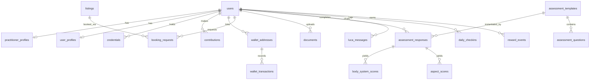

# Database

The data layer is **PostgreSQL**. This document describes the live production
schema (27 tables), the entity relationships, indexing, migrations, and backup.

> ⚠️ **Schema source of truth.** The repository's legacy `backend/schema.sql` is
> **outdated** and does not match the running database. This document reflects the
> *actual* live schema. Treat the live database (or a `pg_dump`) as authoritative.

## Table of Contents

- [Overview](#overview)
- [Core tables](#core-tables)
- [Entity-relationship diagram](#entity-relationship-diagram)
- [Key table definitions](#key-table-definitions)
- [Indexing](#indexing)
- [Migrations](#migrations)
- [Backup & restore](#backup--restore)

---

## Overview

| Domain | Tables |
|--------|--------|
| **Identity & profiles** | `users`, `user_profiles`, `patients`, `practitioners`, `practitioner_profiles` |
| **Assessment** | `assessment_templates`, `assessment_questions`, `assessment_answers`, `assessment_responses`, `aspect_scores`, `body_system_scores` |
| **Journey** | `daily_checkins`, `documents`, `booking_requests`, `habit_plans`, `recommendations`, `treatments` |
| **Marketplace** | `listings` |
| **AI** | `luca_messages` |
| **Rewards** | `reward_events` |
| **Sovereignty / web3** | `vault_entries`, `wallet_addresses`, `wallet_transactions`, `credentials`, `contributions`, `agents` |
| **Audit** | `audit_logs` |

All 27 tables: `agents`, `aspect_scores`, `assessment_answers`,
`assessment_questions`, `assessment_responses`, `assessment_templates`,
`audit_logs`, `body_system_scores`, `booking_requests`, `contributions`,
`credentials`, `daily_checkins`, `documents`, `habit_plans`, `listings`,
`luca_messages`, `patients`, `practitioner_profiles`, `practitioners`,
`recommendations`, `reward_events`, `treatments`, `user_profiles`, `users`,
`vault_entries`, `wallet_addresses`, `wallet_transactions`.

---

## Core tables

### `users`
The root identity. Note the optional `did` / `nostr_npub` columns that carry
self-sovereign identity, and `love_points` for the rewards system.

| Column | Type | Notes |
|--------|------|-------|
| `id` | serial PK | |
| `email` | text | unique login |
| `password_hash` | text | bcrypt; never returned to clients |
| `full_name`, `first_name`, `last_name` | text | |
| `role` | text | `patient` / `practitioner` / `admin` |
| `avatar_url`, `bio` | text | |
| `nostr_npub`, `did` | text | self-sovereign identity (optional) |
| `country`, `city`, `language`, `phone` | text | `language` default `English` |
| `onboarding_status` | text | default `pending` |
| `current_phase` | text | default `onboarding` |
| `love_points` | int | default `0` |
| `created_at`, `updated_at`, `deleted_at` | timestamptz | soft-delete via `deleted_at` |

### `reward_events`
Append-only LOVE point ledger.

| Column | Type |
|--------|------|
| `id` | serial PK |
| `user_id` | FK → users |
| `event_type` | text (e.g. `account_created`) |
| `points` | int |
| `category`, `note` | text |
| `created_at` | timestamptz |

### `daily_checkins`
| Column | Type |
|--------|------|
| `id` | serial PK |
| `user_id` | FK → users |
| `checkin_date` | date |
| `energy_score`, `mood_score` | int |
| `sleep_hours` | numeric |
| `hydration_glasses`, `movement_minutes` | int |
| `notes` | text |
| `created_at` | timestamptz |

### `assessment_responses`
| Column | Type |
|--------|------|
| `id` | serial PK |
| `user_id`, `template_id` | FK |
| `started_at`, `completed_at`, `created_at` | timestamptz |
| `raw_score`, `vitality_score` | numeric |
| `mental_score`, `emotional_score`, `physical_score`, `spiritual_score` | numeric |
| `summary_json`, `top_focus_areas_json` | jsonb |

### `luca_messages`
| Column | Type |
|--------|------|
| `id` | serial PK |
| `user_id` | FK → users |
| `role` | text (`user` / `assistant`) |
| `content` | text |
| `model` | text — provenance of an assistant reply |
| `created_at` | timestamptz |

### `wallet_addresses`
| Column | Type |
|--------|------|
| `id` | serial PK |
| `user_id` | FK → users |
| `chain` | text (`ethereum`/`polygon`/`solana`/`bitcoin`) |
| `address`, `address_enc` | text |
| `label`, `provider` | text |
| `verified` | bool |
| `is_primary` | bool |
| `verified_at`, `created_at`, `updated_at` | timestamptz |

Constraints: `UNIQUE(user_id, chain, address)` and a **partial unique index**
`uq_wallet_primary (user_id) WHERE is_primary` — at most one primary wallet per user.

### `wallet_transactions`
| Column | Type |
|--------|------|
| `id` | serial PK |
| `user_id`, `wallet_address_id` | FK |
| `tx_hash`, `chain`, `type`, `token`, `counterparty` | text |
| `amount` | numeric |
| `block_time`, `created_at` | timestamptz |
| `raw_json` | jsonb |

### `booking_requests`
`id`, `user_id`, `listing_id`, `status` (default `requested`), `preferred_date`,
`preferred_time`, `note`, `admin_notes`, `quoted_price`, `payment_status`
(default `none`), `created_at`, `updated_at`.

### `documents`
`id`, `user_id`, `response_id`, `document_type`, `file_name`, `file_data`,
`mime_type`, `description`, `visibility` (default `private`), `created_at`.

### `contributions` / `credentials`
Sovereignty primitives. `contributions` records verifiable acts (with
`reward_sats`, `gps_value`, `verified_at`, `public`); `credentials` records
issued/held verifiable credentials (`issuer_id`, `holder_id`, `credential_type`,
`verified_at`, `expires_at`, `public`). Both support soft delete via `deleted_at`.

---

## Entity-relationship diagram



---

## Key table definitions

To inspect any table's exact definition against the live database:

```bash
psql "$DATABASE_URL" -c "\d+ users"
psql "$DATABASE_URL" -c "\d+ wallet_addresses"
```

To regenerate a complete, authoritative schema file:

```bash
pg_dump "$DATABASE_URL" --schema-only --no-owner > backend/schema.generated.sql
```

---

## Indexing

| Table | Index | Purpose |
|-------|-------|---------|
| `users` | unique on `email` | login lookups |
| `wallet_addresses` | `UNIQUE(user_id, chain, address)` | dedupe links |
| `wallet_addresses` | partial unique `(user_id) WHERE is_primary` | one primary wallet |
| `daily_checkins` | `(user_id, checkin_date)` | trends range scans |
| `luca_messages` | `(user_id, created_at)` | chat history ordering |
| `reward_events` | `(user_id)` | LOVE ledger aggregation |

When adding indexes for new query patterns, prefer composite indexes that match the
`WHERE` + `ORDER BY` of the hot path (e.g. timeline/trends range scans).

---

## Migrations

The project currently applies schema changes via SQL scripts in `backend/`. Guidelines:

1. **Backward compatible only.** Add columns with `ALTER TABLE ... ADD COLUMN` and a
   default; never drop/rename columns in place without a deprecation window.
2. **One change per script**, named with a timestamp prefix.
3. **Verify on a copy** before applying to production.
4. After a structural change, regenerate `schema.generated.sql` (above) so the repo
   reflects reality — the legacy `schema.sql` should be considered deprecated.

---

## Backup & restore

```bash
# Backup (schema + data)
pg_dump "$DATABASE_URL" --no-owner --format=custom > backup_$(date +%F).dump

# Restore into a fresh database
pg_restore --no-owner --clean --if-exists -d "$DATABASE_URL" backup_2026-06-28.dump

# Plain SQL backup
pg_dump "$DATABASE_URL" --no-owner > backup.sql
```

For Docker deployments:

```bash
docker exec luca-passport-postgres-1 pg_dump -U luca_user luca_passport > backup.sql
```

Schedule regular backups and test restores periodically — an untested backup is not a
backup.
