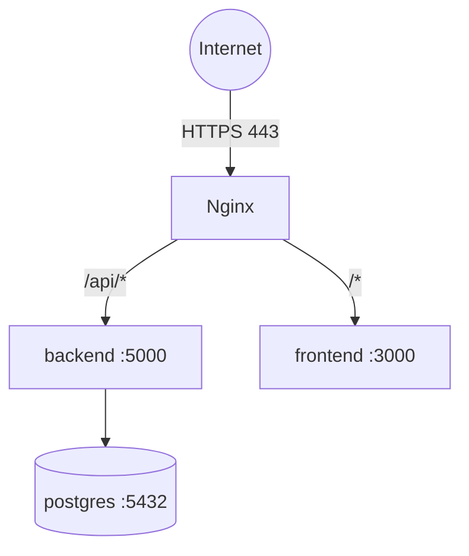

# Deployment

How to deploy **Solaris Health / LUCA Passport** to production with Docker Compose
behind an Nginx reverse proxy. The live demo runs this exact stack at
**[solaris-health.abacusai.cloud](https://solaris-health.abacusai.cloud)**.

## Table of Contents

- [Topology](#topology)
- [Prerequisites](#prerequisites)
- [Environment variables](#environment-variables)
- [Deploy with Docker Compose](#deploy-with-docker-compose)
- [Nginx reverse proxy](#nginx-reverse-proxy)
- [Deploying updates](#deploying-updates)
- [Health checks & monitoring](#health-checks--monitoring)
- [Backups](#backups)
- [Troubleshooting](#troubleshooting)

---

## Topology



Three long-running services (`frontend`, `backend`, `postgres`) plus a one-shot
`seed` job, defined in `docker-compose.yml` on the `solaris-network` bridge.

---

## Prerequisites

- Docker & Docker Compose v2
- A domain name pointed at the host
- Nginx (host-level) for TLS termination and routing
- (Optional) explorer API keys for richer wallet transaction history

---

## Environment variables

Set these in the shell or an `.env` file next to `docker-compose.yml`:

| Variable | Used by | Notes |
|----------|---------|-------|
| `DB_PASSWORD` | postgres, backend, seed | Postgres password (default `luca_prod_2026`) |
| `JWT_SECRET` | backend | **Set a long random secret in production** |
| `API_URL` | frontend build | Public base URL, e.g. `https://solaris-health.abacusai.cloud` |
| `LUCA_AI_MODE` | backend | `mock` (offline) or cloud mode with an LLM key |
| `ETHERSCAN_API_KEY` etc. | backend | Optional — enables wallet tx history |

> The frontend bundle bakes `VITE_API_URL` at **build time**, so `API_URL` must be set
> when you build the frontend image, or it defaults to `http://localhost:5000`.

---

## Deploy with Docker Compose

```bash
git clone https://github.com/solaris-health/luca-passport.git
cd luca-passport

export DB_PASSWORD='a-strong-password'
export JWT_SECRET='a-long-random-secret'
export API_URL='https://solaris-health.abacusai.cloud'

# Build & start everything
docker compose up -d --build

# Seed demo data (one-shot)
docker compose run --rm seed

# Verify
docker compose ps
curl http://localhost:5000/api/health
```

Containers are named `luca-passport-{frontend,backend,postgres}-1` and restart
`unless-stopped`.

---

## Nginx reverse proxy

Example host-level vhost terminating TLS and routing to the containers:

```nginx
server {
    listen 443 ssl;
    server_name solaris-health.abacusai.cloud;

    # ssl_certificate / ssl_certificate_key managed by your TLS tooling

    location /api/ {
        proxy_pass http://127.0.0.1:5000;
        proxy_set_header Host $host;
        proxy_set_header X-Real-IP $remote_addr;
        proxy_set_header X-Forwarded-For $proxy_add_x_forwarded_for;
        proxy_set_header X-Forwarded-Proto $scheme;
    }

    location / {
        proxy_pass http://127.0.0.1:3000;
        proxy_http_version 1.1;
        proxy_set_header Upgrade $http_upgrade;
        proxy_set_header Connection "upgrade";
        proxy_set_header Host $host;
    }
}
```

```bash
sudo nginx -t && sudo systemctl reload nginx
```

---

## Deploying updates

Because application code is **baked into the images** (no bind mounts), you must
rebuild the affected service:

```bash
# Backend changes (e.g. new routes, health/metrics)
docker compose up -d --build backend

# Frontend changes (remember API_URL at build time)
API_URL='https://solaris-health.abacusai.cloud' docker compose up -d --build frontend
```

Database schema changes: apply backward-compatible migrations (see
[DATABASE.md → Migrations](./DATABASE.md#migrations)).

---

## Health checks & monitoring

| Endpoint | Purpose |
|----------|---------|
| `GET /api/health` | JSON liveness + DB check; returns `503` if the DB is down |
| `GET /api/metrics` | Prometheus-format metrics |

```bash
curl https://solaris-health.abacusai.cloud/api/health
curl https://solaris-health.abacusai.cloud/api/metrics
```

Wire `/api/metrics` into Prometheus and alert on `luca_up == 0` or
`luca_database_up == 0`. See [PERFORMANCE.md](./PERFORMANCE.md).

---

## Backups

```bash
docker exec luca-passport-postgres-1 pg_dump -U luca_user luca_passport > backup_$(date +%F).sql
```

Automate daily and test restores — see [DATABASE.md → Backup & restore](./DATABASE.md#backup--restore).

---

## Troubleshooting

| Symptom | Likely cause / fix |
|---------|-------------------|
| `/api/health` returns 503 | DB unreachable — check `postgres` container & `DATABASE_URL` |
| Frontend calls `localhost:5000` in prod | `API_URL` not set at frontend **build** time — rebuild frontend |
| 401 on every request | `JWT_SECRET` changed/mismatched between deploys |
| Wallet tx history empty | No explorer API key — expected; balances still work |
| Seed data missing | Run `docker compose run --rm seed` |
| Backend changes not live | Rebuild: `docker compose up -d --build backend` |

Logs:
```bash
docker compose logs -f backend
docker compose logs -f frontend
```
