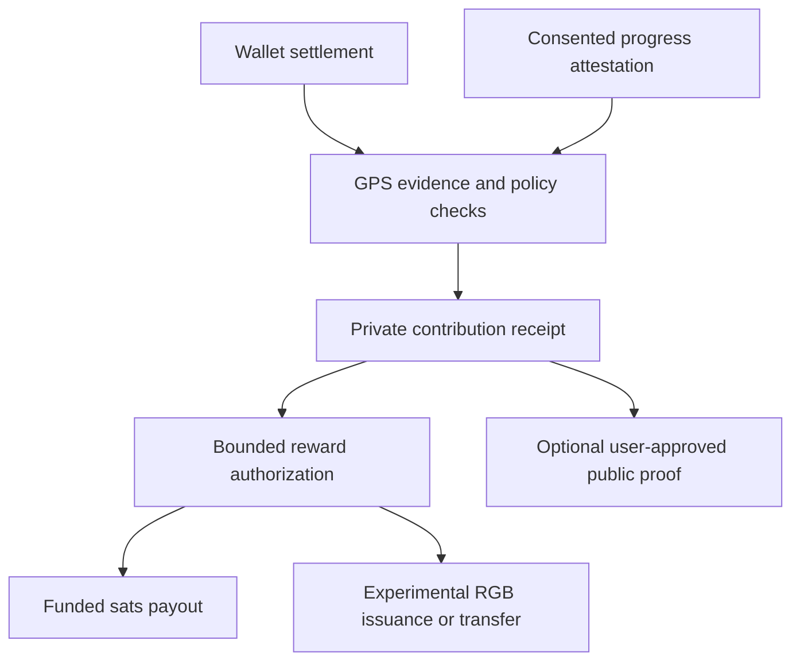

# Economic Passport — target architecture

Owner direction and technical research reconciled on **24 September 2026**. This is an implementation proposal. It does not enable payments, issue assets, establish a partnership or certify production readiness. [Current state](CURRENT-STATE.md) separates inspected source from this target.

## Product and privacy boundary

The Health Passport holds private health information and consented progress evidence. The Economic Passport presents payment accounts, contribution receipts and optional public achievements. GPS is the policy/evidence layer connecting qualifying activities to contribution recognition. The public web supports discovery and coordination; a user's raw vault does not become a public profile or payment-provider input.

The intended practitioner relationship is with a practice, clinic, venue or registered business. Professional verification, business affiliation, identity/personhood checks, reviews and payment acceptance are different claims and need their own evidence, issuer, expiry and correction paths. Planned VTV/Self work must not collapse these into one “verified” badge.

LUCA guidance may use explicitly authorized context through a selected private-provider path, or eventually local inference on capable devices/nodes. Maple selection does not itself establish consent enforcement, acceptable outbound context, local computation or completed runtime activation. Peer communication using Pear/Holepunch or another reviewed transport is a separate prototype; no Keet partnership, embedded SDK availability or mobile P2P acceptance is asserted here.

## Adapter choices

| Component | Target decision | Acceptance still needed |
| --- | --- | --- |
| Bitcoin / digital gold | Breez SDK–Spark is the preferred first adapter. | Supported mobile runtime, version/license, receive/pay, fee and settlement states, backup, recovery and exit behavior. Existing direct Spark code must be inventoried before replacement. |
| Alternative Bitcoin | Second Bark/Ark, conditional on the SatsPath contract or measured integration benefit. | Run the same receive/pay/recovery scenario. Do not assume a seed restores all local history or pending exits independently of a server. |
| Digital dollars | Tether WDK on an explicitly selected USD₮ chain/token. | Network/asset identity, fees, recovery, supported device runtime and separation from BTC balances. The network is not selected by this document. |
| Fiat top-up | MoonPay through a supported integration. | Exact country/asset/network support, provider account, sandbox flow, quote expiry, settlement reconciliation and refund/failure states. Signing secrets stay behind an authenticated server boundary. |
| External wallet | Optional Alby/Nostr Wallet Connect. | Scoped spend permissions, expiry/revocation, budget caps and independent connection keys. No reuse of public identity keys for payment authorization. |
| RGB asset layer | Separate research adapter, after payment/receipt foundations. | Schema, issuer keys, asset state backup, mobile support and tested transfer/recovery. Bitcoin support alone does not imply RGB support. |

Upstream availability is not Solaris acceptance. Breez documents supported mobile/web bindings and recommends Spark for new/current builders. WDK publishes a MoonPay module; Breez also documents a BTC purchase integration, so WDK is not required merely to fund BTC. Self-custody still has provider, availability, backup and exit assumptions. Keep each rail's units and settlement status explicit; never present BTC, USD₮ and experimental asset quantities as one redeemable balance.

## GPS evidence flow

The initial scope is **qualifying Solaris-mediated activity**, not observation of every transaction in every external wallet. Ordinary payments must remain possible without disclosing health data or waiting for a rewards service. A durable local pending receipt can be reconciled later.

Keep receipts small and versioned: random event ID, issuer/key role, pseudonymous subject, evidence category, policy version, eligibility decision, timestamp and replay protection. Protect sensitive transaction references and health evidence locally or through explicitly authorized encrypted sharing. Hashing a predictable health fact does not make it anonymous.

A signature proves who signed a statement, not that a health claim is true. Payment completion is not clinical improvement. LUCA alone must not authorize issuance or spending. Define permitted attestation issuers and review paths, budget limits, duplicate/replay rejection, refund handling, retries and reconciliation before rewards operate. Non-payment contributions must also be representable.

## Rewards, assets and passport representations

- **Sats:** units of existing bitcoin, paid from an identified funded budget. RGB issuance cannot create BTC or a redemption reserve.
- **LOVE:** proposed asset for individual progress/contribution recognition. Existing application LOVE points are not automatically an RGB asset or migration entitlement.
- **GPS asset:** proposed collective contribution recognition; distinguish this asset from the GPS protocol itself. Supply, issuer authority, transferability, rights and value are undecided.
- **Health/Economic Passport NFTs:** optional research into a credential/collectible reference, not a requirement for using Solaris. Never store health records in public token metadata, use token ownership as patient identity, or transfer health-access consent when a token changes owners. Private receipts can represent a history without minting an NFT for each event.

RGB defines multiple contract schemas, including fungible and unique assets. Solaris still needs a concrete issuance specification and recovery design. `rgb.info` documents the technology; it is not a minting service that issues Solaris assets for us.

Current upstream constraints matter: the WDK RGB module is a third-party beta integration; its documented native targets do not establish Android acceptance, and its account API does not expose the required unique-asset issuance for passport NFTs. RGB wallet state needs backup beyond the seed. The inspected RGB Lightning Node implementation labels its RGB functionality early alpha/test-network work. Production interoperability between RGB, Breez Spark, Bark and Alby is not established by their separate support for Bitcoin.

## Social proof and collaboration status

| Organization / protocol | Truthful relationship description |
| --- | --- |
| SatsPath | Founder-reported co-creation/collaboration; intended first GPS pilot. Obtain API/repository/license, supported network and payment lifecycle before depending on it. The founder-reported Second connection has not been independently confirmed here. |
| Breez and Tether WDK | Owner-selected integration direction. No formal partnership or shipped Solaris implementation asserted. |
| Second | Technical alternative and possible SatsPath dependency, pending evidence. |
| Alby | Desired collaboration and proposed optional wallet/social contribution connection. |
| BTC Map | Planned merchant discovery linkage. Start with read-only data and appropriate attribution; privileged write access and two-way synchronization require a separate agreement/interface. It is not a practitioner-credential registry. |
| RGB | Proposed asset technology, with issuance and operational details still open. |

Public Nostr posts must be separately previewed and opted into. Use minimal achievement disclosures; exclude health details, exact clinic visits, payment preimages and permanent joins between medical and spending history. Public npub identity and NWC spending keys serve different purposes. Revoking access cannot erase copies already received.

## Staged acceptance

1. **ECO-01, receipt contract:** synthetic signed events; consent boundaries, idempotency, issuer/policy validation, pending/retry/refund states and private/public separation. No funds or minting.
2. **ECO-02, one Bitcoin adapter:** create/recover a test wallet, receive/pay and reconcile a receipt on supported test infrastructure. Compare Bark only if the SatsPath integration or measured acceptance criteria justify it. Do not migrate existing keys or balances implicitly.
3. **ECO-03, WDK/MoonPay:** choose the supported USD₮ network, demonstrate sandbox top-up and failure handling, then obtain a distinct real-funds decision.
4. **ECO-04, RGB/social proofs:** test asset issuance/transfer/state recovery on supported test infrastructure; optional Alby/NWC and BTC Map reads; synthetic opt-in public proof. Passport NFTs remain optional research.

Clinic-owned nodes, local inference and companion applications follow their own deployment and acceptance contracts. A complete rewrite is not a prerequisite: retain proven identity, interface and test seams; replace or retire legacy modules through explicit contracts that preserve user data and recovery.

## Primary references checked on 24 September 2026

- [Breez SDK–Spark bindings](https://sdk-doc-spark.breez.technology/guide/install.html), [Liquid migration notice](https://sdk-doc-liquid.breez.technology/), [BTC purchase integration](https://sdk-doc-spark.breez.technology/guide/buy_bitcoin.html).
- [WDK MoonPay setup](https://docs.wdk.tether.io/sdk/fiat-modules/fiat-moonpay/guides/get-started/), [supported purchase flow](https://docs.wdk.tether.io/sdk/fiat-modules/fiat-moonpay/guides/buy-and-sell/).
- [Second Bark SDK](https://second.tech/docs/bark-sdk), [backup requirements](https://second.tech/docs/backups).
- [RGB schemas](https://docs.rgb.info/rgb-contract-implementation/schema/supported-schemas), [client-side validation](https://rgb.info/learn/client-side-validation/), [WDK community RGB module](https://docs.wdk.tether.io/sdk/community-modules/wdk-wallet-rgb/), [RGB Lightning Node](https://github.com/RGB-Tools/rgb-lightning-node).
- [Alby connections](https://guides.getalby.com/user-guide/alby-hub/app-connections/app-store), [NIP-47](https://github.com/nostr-protocol/nips/blob/master/47.md), [BTC Map API interfaces](https://github.com/teambtcmap/btcmap-api/blob/master/docs%2FREADME.md).

These sources establish upstream capabilities and limitations, not endorsement of Solaris or delivery of the proposed integrations.
